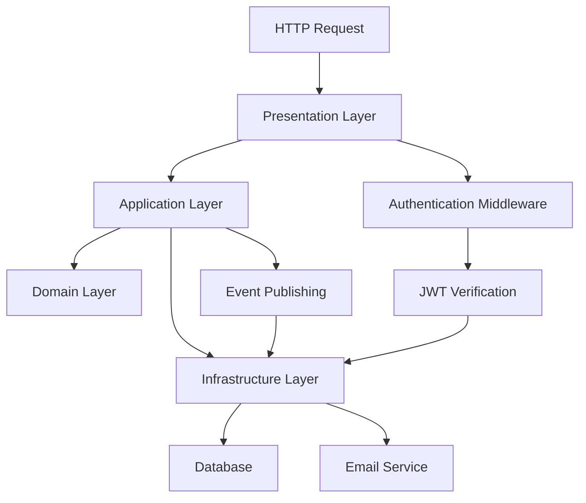

# Complete System Flows - QR Attendance System

## Overview

This document provides a comprehensive trace of every use case through the entire system architecture, from HTTP request entry point to final HTTP response. Each flow shows the exact path through all layers: Presentation → Application → Domain → Infrastructure and back.

## 🏗️ System Architecture Layers

```
┌─────────────────────────────────────────────────────────────────┐
│                    📡 HTTP REQUEST                              │
└─────────────────────────────────────────────────────────────────┘
                                │
┌─────────────────────────────────────────────────────────────────┐
│                🎯 PRESENTATION LAYER                            │
│  • Views (API endpoints)                                        │
│  • Serializers (Request/Response validation)                    │
│  • Authentication (JWT middleware)                              │
│  • Error handling & HTTP status codes                           │
└─────────────────────────────────────────────────────────────────┘
                                │
┌─────────────────────────────────────────────────────────────────┐
│                📋 APPLICATION LAYER                             │
│  • Commands (Use case inputs)                                   │
│  • Handlers (Use case orchestration)                            │
│  • DTOs (Data transfer objects)                                 │
│  • Event publishing                                             │
└─────────────────────────────────────────────────────────────────┘
                                │
┌─────────────────────────────────────────────────────────────────┐
│                🏛️ DOMAIN LAYER                                  │
│  • Entities (Business logic)                                    │
│  • Value Objects (Domain primitives)                            │
│  • Domain Events (State changes)                                │
│  • Business Rules (Domain invariants)                           │
└─────────────────────────────────────────────────────────────────┘
                                │
┌─────────────────────────────────────────────────────────────────┐
│                🔧 INFRASTRUCTURE LAYER                          │
│  • Repository Implementation (Data persistence)                 │
│  • Authentication Services (Password & JWT)                     │
│  • Email Service (Background tasks)                             │
│  • Database Integration (Django ORM)                            │
└─────────────────────────────────────────────────────────────────┘
                                │
┌─────────────────────────────────────────────────────────────────┐
│                    💾 DATABASE                                  │
└─────────────────────────────────────────────────────────────────┘
```

---

## 🔄 Use Case Flow #1: Lecturer Registration

### 📡 **HTTP Request Entry**
```http
POST /api/v1/auth/register/
Content-Type: application/json
Authorization: Not required

{
  "email": "lecturer@example.com",
  "password": "SecurePassword123!",
  "first_name": "John",
  "last_name": "Doe",
  "employee_id": "EMP001",
  "department_name": "Computer Science"
}
```

### 🎯 **Presentation Layer Flow**

#### Step 1: URL Routing
```python
# File: attendance/presentation/urls.py
path('auth/register/', register_lecturer, name='register_lecturer')
```

#### Step 2: View Function Entry
```python
# File: attendance/presentation/views.py
@api_view(['POST'])
@permission_classes([AllowAny])
@csrf_exempt
def register_lecturer(request: Request) -> Response:
```

#### Step 3: Request Validation
```python
# File: attendance/presentation/serializers.py
serializer = RegisterLecturerSerializer(data=request.data)
if not serializer.is_valid():
    return Response({"error": "Validation failed"}, status=400)
```

#### Step 4: Command Creation
```python
register_command = RegisterLecturerCommand(
    email=serializer.validated_data['email'],
    password=serializer.validated_data['password'],
    first_name=serializer.validated_data['first_name'],
    last_name=serializer.validated_data['last_name'],
    employee_id=serializer.validated_data['employee_id'],
    department_name=serializer.validated_data['department_name'],
)
```

### 📋 **Application Layer Flow**

#### Step 5: Handler Execution
```python
# File: attendance/application/handlers/register_lecturer.py
def handle(self, command: RegisterLecturerCommand) -> RegisterLecturerResult:
```

#### Step 6: Business Rule Check - User Existence
```python
existing_user = self._user_repository.find_by_email(email)
if existing_user is not None:
    raise UserAlreadyExistsError(email.value)
```

### 🏛️ **Domain Layer Flow**

#### Step 7: Password Hashing
```python
password_hash = self._password_service.hash_password(command.password)
```

#### Step 8: User Entity Creation
```python
# File: attendance/domain/entities/user.py
user = User.create_lecturer(
    email=email,
    password_hash=PasswordHash(password_hash),
    first_name=first_name,
    last_name=last_name,
    employee_id=employee_id,
    department_name=department_name
)
```

### 🔧 **Infrastructure Layer Flow**

#### Step 9: User Persistence
```python
# File: attendance/infrastructure/repositories/user_repository.py
def save(self, user: User) -> User:
    # Convert domain entity to ORM model and save
```

### 2. Application Layer - CreateLecturerHandler
```python
def handle(self, request: CreateLecturerRequest) -> CreateLecturerResponse:
    # Validate input
    self.validator.validate_email(request.email)
    self.validator.validate_password(request.password)
    self.validator.validate_name(request.first_name)
    self.validator.validate_name(request.last_name)
    self.validator.validate_department(request.department_name)
    
    # Check if email already exists
    if self.user_repository.exists_by_email(request.email):
        raise EmailAlreadyExistsError(request.email)
    
    # Create domain entities
    user = User.create(
        first_name=request.first_name,
        last_name=request.last_name,
        email=request.email,
        password=self.password_hasher.hash(request.password),
        role=UserRole.LECTURER,
        is_active=True  # Auto-activate lecturers
    )
    
    lecturer_profile = LecturerProfile.create(
        user=user,
        department_name=request.department_name
    )
    
    # Persist
    self.user_repository.save(user)
    self.lecturer_repository.save(lecturer_profile)
    
    # Return response
    return CreateLecturerResponse(
        lecturer_id=lecturer_profile.lecturer_id,
        user_id=user.user_id,
        email=user.email,
        full_name=user.full_name,
        department_name=lecturer_profile.department_name,
        is_active=user.is_active
    )
```

### 📡 **HTTP Response**
```http
HTTP/1.1 201 Created
Content-Type: application/json

{
  "id": "lect_uuid",
  "email": "lecturer@example.com",
  "first_name": "John",
  "last_name": "Doe",
  "role": "LECTURER",
  "employee_id": "EMP001",
  "department_name": "Computer Science",
  "created_at": "2025-10-14T12:00:00.000Z"
}
```

---

## 🔄 Use Case Flow #2: Create Attendance Session

### 📡 **HTTP Request Entry**
```http
POST /api/v1/sessions/
Content-Type: application/json
Authorization: Bearer {lecturer_jwt}

{
  "course_id": "course_uuid",
  "start_time": "2025-10-14T14:00:00Z",
  "end_time": "2025-10-14T16:00:00Z",
  "location": {
    "lat": -1.2921,
    "lon": 36.8219
  },
  "target": {
    "program_id": "prog_uuid",
    "stream_id": "stream_uuid"
  }
}
```

### 🎯 **Presentation Layer Flow**

#### Step 1: Authentication Middleware
```python
# Extract and verify lecturer JWT token
# Load lecturer from repository
```

#### Step 2: Request Validation
```python
serializer = CreateSessionSerializer(data=request.data)
```

#### Step 3: Command Creation
```python
create_session_command = CreateSessionCommand(
    lecturer_id=current_lecturer.id,
    course_id=serializer.validated_data['course_id'],
    start_time=serializer.validated_data['start_time'],
    end_time=serializer.validated_data['end_time'],
    location_lat=serializer.validated_data['location']['lat'],
    location_lon=serializer.validated_data['location']['lon'],
    program_id=serializer.validated_data['target']['program_id'],
    stream_id=serializer.validated_data['target'].get('stream_id')
)
```

### 📋 **Application Layer Flow**

#### Step 4: Handler Execution
```python
# File: attendance/application/handlers/create_session.py
def handle(self, command: CreateSessionCommand) -> CreateSessionResult:
```

#### Step 5: Generate Attendance Token
```python
# File: attendance/infrastructure/jwt_provider.py
attendance_token = self._jwt_provider.create_attendance_token(
    session_id=session.id,
    expiry_minutes=30
)
```

#### Step 6: Enqueue Email Task
```python
# File: attendance/infrastructure/email_tasks.py
send_session_links.delay(
    session_id=str(session.id),
    recipients=student_emails,
    token=attendance_token
)
```

### 📡 **HTTP Response**
```http
HTTP/1.1 201 Created
Content-Type: application/json

{
  "id": "session_uuid",
  "course_id": "course_uuid",
  "lecturer_id": "lect_uuid",
  "start_time": "2025-10-14T14:00:00Z",
  "end_time": "2025-10-14T16:00:00Z",
  "token_link": "https://app.domain/attendance/session_uuid?token={jwt}",
  "created_at": "2025-10-14T12:00:00.000Z"
}
```

---

## 🔄 Use Case Flow #3: Mark Attendance (Student)

### 📡 **HTTP Request Entry**
```http
POST /api/v1/attendance/scan/
Authorization: Bearer {attendance_token}
Content-Type: application/json

{
  "session_id": "session_uuid",
  "student_id": "STU2024001",
  "latitude": -1.2921,
  "longitude": 36.8219
}
```

### 🎯 **Presentation Layer Flow**

#### Step 1: Token Validation
```python
# Extract attendance token from Authorization header
# Verify token signature, expiry, and claims (aud, sub, exp)
```

#### Step 2: Request Validation
```python
serializer = MarkAttendanceSerializer(data=request.data)
```

### 📋 **Application Layer Flow**

#### Step 3: Handler Execution
```python
# File: attendance/application/handlers/mark_attendance.py
def handle(self, command: MarkAttendanceCommand) -> MarkAttendanceResult:
```

#### Step 4: Validate Session and Student
```python
# Check session exists and is active
# Check student belongs to target program/stream
# Check no duplicate attendance
```

### 🏛️ **Domain Layer Flow**

#### Step 5: Location Validation
```python
# File: attendance/domain/services/location_validator.py
is_within_radius = self._location_validator.validate_distance(
    lecturer_lat=session.location_lat,
    lecturer_lon=session.location_lon,
    student_lat=command.latitude,
    student_lon=command.longitude,
    max_distance_meters=30
)
```

#### Step 6: Create Attendance Record
```python
# File: attendance/domain/entities/attendance.py
attendance = Attendance.create(
    session_id=session.id,
    student_id=student.id,
    location_lat=command.latitude,
    location_lon=command.longitude,
    is_within_radius=is_within_radius
)
```

### 🔧 **Infrastructure Layer Flow**

#### Step 7: Attendance Persistence
```python
self._attendance_repository.save(attendance)
```

### 📡 **HTTP Response**
```http
HTTP/1.1 200 OK
Content-Type: application/json

{
  "status": "ok",
  "is_within_radius": true,
  "marked_at": "2025-10-14T14:05:00Z"
}
```

---

## 🚨 Error Flow Examples

### ❌ **Token Expired Error Flow**

#### Step 1: Invalid Token
```http
POST /api/v1/attendance/scan/
Authorization: Bearer {expired_token}
```

#### Step 2: Token Verification Failure
```python
# Token exp claim is in the past
raise TokenExpiredError("Attendance link has expired")
```

#### Step 3: HTTP Error Response
```http
HTTP/1.1 401 Unauthorized
Content-Type: application/json

{
  "error": "Attendance link has expired",
  "code": "TOKEN_EXPIRED",
  "message": "Please request a new link from your lecturer"
}
```

### ❌ **Outside Radius Error Flow**

#### Step 1: Location Validation Fails
```python
# Distance > 30 meters
is_within_radius = False
```

#### Step 2: Attendance Still Created (with flag)
```python
# Record attendance but mark as outside radius
attendance = Attendance.create(..., is_within_radius=False)
```

#### Step 3: HTTP Response with Warning
```http
HTTP/1.1 200 OK
Content-Type: application/json

{
  "status": "recorded",
  "is_within_radius": false,
  "marked_at": "2025-10-14T14:05:00Z",
  "warning": "You are outside the required location radius"
}
```

---

## 📊 System Integration Points

### 🔗 **Cross-Layer Dependencies**



This comprehensive flow documentation shows how every use case in the QR attendance system traverses the entire architecture, maintaining clean separation of concerns while providing complete end-to-end functionality.

---

## 🔄 Use Case Flow #1: Lecturer Registration (Alternative)

### 📡 **HTTP Request Entry**
```http
POST /api/v1/lecturers/register
Content-Type: application/json

{
  "first_name": "John",
  "last_name": "Doe",
  "email": "john.doe@university.edu",
  "password": "SecurePass123!",
  "department_name": "Computer Science"
}
```

### 🎯 **Presentation Layer Flow**

#### Step 1: URL Routing
```python
# File: attendance/presentation/urls.py
path('lecturers/register', register_lecturer_alternative, name='register_lecturer_alternative')
```

#### Step 2: View Function Entry
```python
# File: attendance/presentation/views.py
@api_view(['POST'])
@permission_classes([AllowAny])
@csrf_exempt
def register_lecturer_alternative(request: Request) -> Response:
```

#### Step 3: Request Validation
```python
# File: attendance/presentation/serializers.py
serializer = RegisterLecturerSerializer(data=request.data)
if not serializer.is_valid():
    return Response({"error": "Validation failed"}, status=400)
```

#### Step 4: Command Creation
```python
register_command = RegisterLecturerCommand(
    email=serializer.validated_data['email'],
    password=serializer.validated_data['password'],
    first_name=serializer.validated_data['first_name'],
    last_name=serializer.validated_data['last_name'],
    department_name=serializer.validated_data['department_name'],
)
```

### 📋 **Application Layer Flow**

#### Step 5: Handler Execution
```python
# File: attendance/application/handlers/register_lecturer_alternative.py
def handle(self, command: RegisterLecturerCommand) -> RegisterLecturerResult:
```

#### Step 6: Business Rule Check - User Existence
```python
existing_user = self._user_repository.find_by_email(email)
if existing_user is not None:
    raise UserAlreadyExistsError(email.value)
```

### 🏛️ **Domain Layer Flow**

#### Step 7: Password Hashing
```python
password_hash = self._password_service.hash_password(command.password)
```

#### Step 8: User Entity Creation
```python
# File: attendance/domain/entities/user.py
user = User.create_lecturer(
    email=email,
    password_hash=PasswordHash(password_hash),
    first_name=first_name,
    last_name=last_name,
    department_name=department_name
)
```

### 🔧 **Infrastructure Layer Flow**

#### Step 9: User Persistence
```python
# File: attendance/infrastructure/repositories/user_repository.py
def save(self, user: User) -> User:
    # Convert domain entity to ORM model and save
```

### 2. Application Layer - CreateLecturerHandler
```python
def handle(self, request: CreateLecturerRequest) -> CreateLecturerResponse:
    # Validate input
    self.validator.validate_email(request.email)
    self.validator.validate_password(request.password)
    self.validator.validate_name(request.first_name)
    self.validator.validate_name(request.last_name)
    self.validator.validate_department(request.department_name)
    
    # Check if email already exists
    if self.user_repository.exists_by_email(request.email):
        raise EmailAlreadyExistsError(request.email)
    
    # Create domain entities
    user = User.create(
        first_name=request.first_name,
        last_name=request.last_name,
        email=request.email,
        password=self.password_hasher.hash(request.password),
        role=UserRole.LECTURER,
        is_active=True  # Auto-activate lecturers
    )
    
    lecturer_profile = LecturerProfile.create(
        user=user,
        department_name=request.department_name
    )
    
    # Persist
    self.user_repository.save(user)
    self.lecturer_repository.save(lecturer_profile)
    
    # Return response
    return CreateLecturerResponse(
        lecturer_id=lecturer_profile.lecturer_id,
        user_id=user.user_id,
        email=user.email,
        full_name=user.full_name,
        department_name=lecturer_profile.department_name,
        is_active=user.is_active
    )
```

### 📡 **HTTP Response**
```http
HTTP/1.1 201 Created
Content-Type: application/json

{
  "success": true,
  "data": {
    "lecturer_id": 123,
    "user_id": 456,
    "email": "john.doe@university.edu",
    "full_name": "John Doe",
    "department_name": "Computer Science",
    "is_active": false,
    "message": "Registration successful. Awaiting admin activation."
  }
}
```
